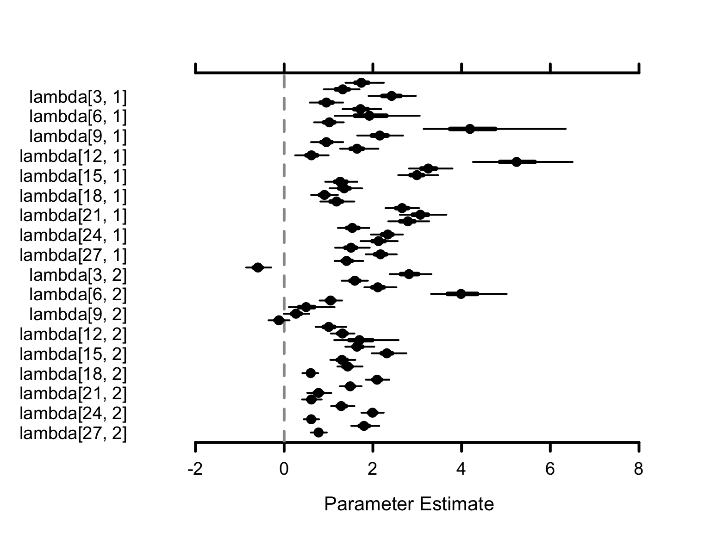

# Beginner Tutorial: Introduction to Bayesian Modeling with PGDCM

## Introduction

This tutorial is designed as an introductory resource for researchers
and practitioners seeking a quick, practical guide to probabilistic
programming and Bayesian psychometric modeling through `pgdcm`.

> **Learning Objectives:**
>
> By the end of this tutorial, you will learn how to:
>
> 1.  Prepare your item response data and Q-Matrix (evidence model) for
>     analysis with the `pgdcm` package.
> 2.  Link your formatted data to the underlying graphical network
>     required for the model.
> 3.  Execute a Bayesian MCMC sampler without writing complex, manual
>     configuration code.
> 4.  Extract and interpret the resulting posterior distributions and
>     convergence diagnostics.

## 1. Environment Requirements

Before calling any functions from `pgdcm`, make sure you have loaded the
`nimble` package. The `nimble` package functions as the core
probabilistic programming and MCMC estimation engine for `pgdcm`, so it
is **critical** to load it *before* loading our package.

We will also load `dcmdata`, which contains standard cognitive datasets
for us to test our models on. For this tutorial, we will use the DTMR
dataset. You can learn more about the dataset here:
https://dcmdata.r-dcm.org/reference/dtmr.html

``` r
library(nimble)
library(pgdcm)
library(dcmdata)
```

## 2. Preparing the Data and the Evidence Model

Diagnostic Classification Models (DCMs) evaluate whether participants
have mastered the specific skills an assessment is designed to measure.
To estimate this, the model requires two key components:

1.  **Observational Data (`X`)**: The actual test responses from
    participants, typically consisting of 1s (correct) and 0s
    (incorrect). This forms an $N \times J$ matrix, where $N$ is the
    number of participants and $J$ is the number of questions (items).
2.  **The Q-Matrix (`Q`)**: An evidence model specifying *which exact
    skills* are required to answer each question correctly. This forms a
    $J \times K$ matrix, where $J$ is the number of questions and $K$ is
    the number of skills (attributes). Specifically, an entry of 1 in
    the $j$-th row and $k$-th column indicates that the $k$-th skill is
    required to answer the $j$-th question, while a 0 indicates it is
    not.

Let’s load our sample dataset and Q-Matrix:

``` r
X <- dtmr_data
Q <- dtmr_qmatrix
```

The `pgdcm` package mathematically treats modern psychometric models as
probabilistic graphical models (specifically, Directed Acyclic Graphs or
Bayesian Networks). Because of this, we must first convert our standard
Q-Matrix into a Directed Acyclic Graph (`g`) that represents the
underlying node dependencies—i.e., the dependencies between the skills
and the tasks/test items. The
[`QMatrix2iGraph()`](../reference/QMatrix2iGraph.md) function handles
this graphical conversion automatically for us.

Once we have constructed the core network graph, several model
parameters must be defined to establish the active modeling environment
for NIMBLE. This includes validating topological constraints, isolating
constants required for `nimble` inference calculations, and setting
initial values for the model parameters. The
[`build_model_config()`](../reference/build_model_config.md) function
handles all of this heavy lifting.

``` r
# Restructure Matrix to an iGraph object
g <- QMatrix2iGraph(Q)

# Link student responses to the Graph
config <- build_model_config(g, X)
```

It is important to note that by default,
[`build_model_config()`](../reference/build_model_config.md) assumes a
**DINA** (Deterministic Input, Noisy “And” gate) compute type. This
implies a strict, non-compensatory cognitive framework—meaning a student
*must* possess all required skills dictated by the Q-Matrix to likely
answer an item correctly; mastering just one or a few required skills
provides no additional benefit. If your assessment follows a different
theoretic framework, you can overwrite this by supplying options like
`compute = "dino"` or `compute = "dinm"`:

- **`compute = "dino"` (Deterministic Input, Noisy “Or” gate)**: Assumes
  a fully compensatory framework. Here, possessing *at least one* of the
  required skills is sufficient to likely answer the item correctly.
- **`compute = "dinm"` (Deterministic Input, Noisy “Mixed”)**: Assumes a
  proportional or additive framework. In this model, each additional
  required skill a student masters incrementally increases their
  probability of answering correctly.

## 3. Estimation Pipeline

In a traditional Bayesian workflow, setting up the configuration for
both the model and the MCMC sampler requires a non-trivial amount of
code. To keep the process streamlined and robust, the
[`run_pgdcm_auto()`](../reference/run_pgdcm_auto.md) function automates
this step. It initializes the model with sensible default values, runs
the MCMC sampler for you, and saves the results directly to your working
directory.

*Note: MCMC algorithms construct a Markov chain to recursively explore
the unknown probability distributions of our parameters. Evaluating
these complex prior-likelihood constraints across thousands of
iterations is computationally intensive and can realistically slow down
documentation rendering. Therefore, it is standard workflow practice to
execute and save your chain results to disk via
[`saveRDS()`](https://rdrr.io/r/base/readRDS.html) locally, and load
them for post-model fitting inference or analysis.*

``` r
results <- run_pgdcm_auto(
    config = config,
    prefix = "DINA_DTMR" # You can give any name here. This prefix is used while saving
    # the prior predictive and posterior predictive simulation results.
)

# Save the exact results to an RDS file to bypass future recomputation
saveRDS(results, "Beginner_Tutorial_Results.rds")
```

> **What’s happening under the hood of run_pgdcm_auto?**
>
> Under the hood, [`run_pgdcm_auto()`](../reference/run_pgdcm_auto.md)
> handles several complex configurations so you don’t have to manually
> code them. The function configures the MCMC algorithmic engine with
> the following default parameters:
>
> - **`niter = 2000`**: The total number of MCMC samples to draw per
>   chain.
> - **`nburnin = 500`**: The number of initial samples to discard. MCMC
>   algorithms take time to traverse towards the high-probability
>   region; discarding early “burn-in” samples ensures we only analyze
>   parameters after they have reached a stable state.
> - **`chains = 2`**: The algorithm runs two independent sampling
>   processes simultaneously to ensure they both converge onto the same
>   distribution.
>
> Additionally, standard comprehensive workflows evaluate the viability
> of a model using simulation. While `run_pgdcm_auto` has arguments
> (`prior_sims = NULL`, `post_sims = NULL`) that bypass this by default
> for speed, they are critical components of a full Bayesian workflow:
>
> - **Prior Predictive Checking**: Before seeing the actual data, what
>   kind of data does the model *think* it will see based purely on our
>   initial parameter bounds (priors)? This ensures our initial limits
>   are logical and not mathematically impossible.
> - **Posterior Predictive Checking**: After the network learns the
>   distribution, we simulate student response patterns utilizing the
>   trained distributions. We then compare these simulated response
>   patterns against the *real* observational data. If the model
>   accurately captured the underlying psychometric properties, the
>   simulated data should closely resemble the real data.

## 4. Interpreting the Bayesian Output

Unlike standard frequentist statistics which often output a single “best
guess” point estimate, Bayesian inference through MCMC outputs
**thousands of plausible values drawn from the joint posterior
distribution**. This fundamental difference allows us to naturally
extract comprehensive metrics like the **posterior mean** and **credible
intervals** to formally quantify our uncertainty.

To easily read and interpret these distributions, we will load our
cached `.rds` file and use the `MCMCvis` package.

``` r
# Load our pre-cached exact results from the pipeline above
results <- readRDS("Beginner_Tutorial_Results.rds")
library(MCMCvis)
```

### Numerical Analytics

By passing our raw MCMC `samples` into the
[`MCMCsummary()`](https://rdrr.io/pkg/MCMCvis/man/MCMCsummary.html)
function, we can collapse the complex distributions into a clean summary
table that provides point estimates and measures of numerical
uncertainty.

The `lambda` parameters in our model capture the properties of the test
items themselves. For each test item $j$:

- **`lambda[j, 1]` (Discrimination / Slope)**: Represents how
  effectively the item distinguishes between participants who possess
  the required skills and those who do not. A higher value indicates the
  item strongly differentiates between mastery states.
- **`lambda[j, 2]` (Difficulty / Intercept)**: Represents the baseline
  difficulty of the item. A higher value typically means the question is
  inherently harder to answer correctly overall.

*(There are also other parameter families estimated in the graphical
model that capture the **attribute network** itself. For example,
`beta_root` parameters represent the baseline prevalence of foundational
“root” skills in the population. The `theta` parameters function
similarly to `lambda`, but are applied to higher-level skills, carrying
their own dependencies and baseline difficulties.)*

We can extract a numerical summary matrix specifically for our `lambda`
parameters to inspect how the test items functioned:

``` r
# Retrieve a numerical summary table specifically for the 'lambda' item parameters
res <- MCMCsummary(results$samples, params = "lambda")
head(res) # only a few rows from res are displayed here.
```

                      mean        sd      2.5%       50%    97.5% Rhat n.eff
    lambda[1, 1] 1.7512409 0.2142891 1.3824153 1.7402970 2.247491 1.43    68
    lambda[2, 1] 1.3103394 0.2119471 0.8939294 1.3198143 1.698902 1.02   151
    lambda[3, 1] 2.4237264 0.2828668 1.9031875 2.4225588 2.967375 1.08    51
    lambda[4, 1] 0.9529481 0.1925619 0.5754743 0.9500665 1.327190 1.01   107
    lambda[5, 1] 1.7350918 0.2272166 1.3164859 1.7212369 2.187425 1.03    71
    lambda[6, 1] 1.9637383 0.4919925 1.1386391 1.9218624 3.056010 1.14    39

**How to Read the Table:**

- **`mean`**: The expected value or best estimate for the parameter.
  This conceptually corresponds to the traditional point estimate you
  would obtain in a frequentist approach.
- **`2.5%` and `97.5%`**: These bounds define the **95% Credible
  Interval**. In Bayesian inference, this means there is a 95%
  probability that the true underlying parameter value falls within this
  specific range.
- **`Rhat`**: A convergence diagnostic (Gelman-Rubin statistic). If
  `Rhat` is greater than 1.1, it generally indicates the MCMC chains
  have not yet converged, and you may need to substantially increase the
  `niter` (number of iterations) in your estimation step. Sometimes
  `Rhat` values remain greater than 1.1 due to an underlying model
  misspecification. This issue can typically be identified if you
  continue to increase the number of iterations and observe no
  improvement in the convergence diagnostics.

### Visual Analytics

Reviewing hundreds of rows in a table can be exhausting. MCMC
visualization functions like
[`MCMCplot()`](https://rdrr.io/pkg/MCMCvis/man/MCMCplot.html) can
transform these parameter boundaries into intuitive visual “Caterpillar
Plots”.

*Note: Because we estimated 54 item parameters for this dataset,
plotting them all simultaneously can vertically cramp the screen.
Standard R plotting packages (like `MCMCvis`) may auto-truncate the
Y-axis labels to fit the visual constraints, occasionally dropping some
text labels to save space.*

``` r
# Visually plot the 'lambda' parameter distributions
MCMCplot(results$samples, params = "lambda")
```



**How to Interpret the Visuals:** Each dot represents the mean estimate
for a specific parameter. The horizontal lines stretching outwards
illustrate the 95% Credible Interval.

- A wider line indicates high uncertainty (a broader credible interval)
  for that parameter.
- A shorter, narrower line indicates the model is highly confident in
  its estimate (a tighter credible interval) for that parameter.

> **Next Steps**
>
> Ready to dive deeper? Check out the [Advanced
> Tutorial](https://coinslab.github.io/pgdcm/articles/Advanced_Tutorial.html)
> to learn about customizing models, diagnosing chains, and configuring
> the PGDCM engine natively.
