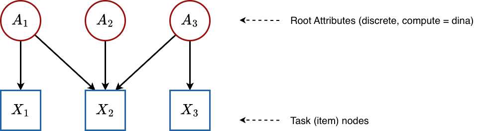
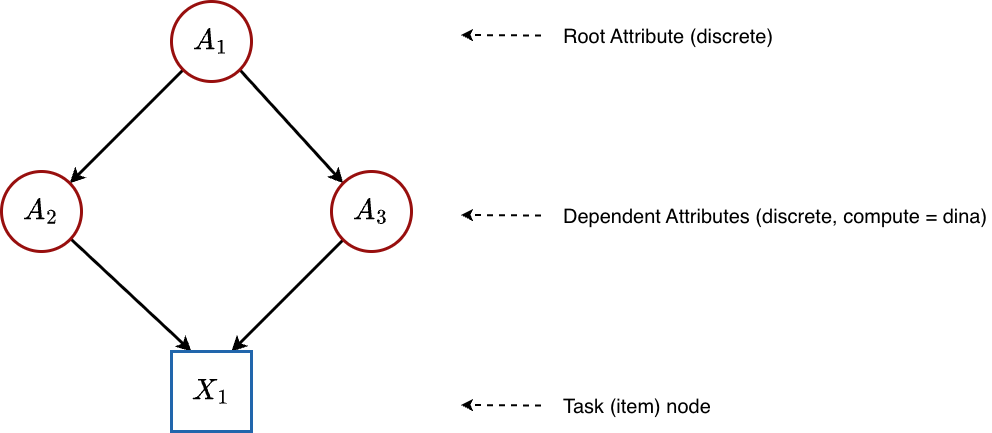
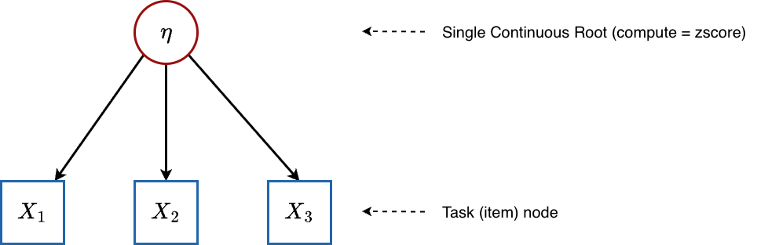
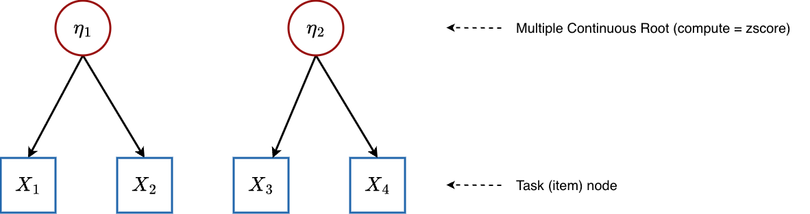
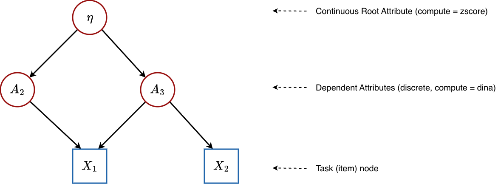

# Mathematical Foundations of the PGDCM Bayesian Network Model

## Introduction

At the heart of the `pgdcm` package lies a single, unified Bayesian
network model defined in the file `loglinearBN.R`. This one piece of
NIMBLE code is highly flexible: depending on how you configure your
graph (i.e., which node types and compute rules you assign), it can
express a standard **Diagnostic Classification Model (DCM)**, an **Item
Response Theory (IRT)** model, a **Multidimensional IRT (MIRT)** model,
or a **Higher-Order DCM (HO-DCM)**.

This vignette is written for readers who want to understand *exactly*
what the model is doing mathematically. We will walk through:

1.  The **general equation** that governs every node in the network.
2.  The three **condensation rules** (DINA, DINO, DINM) that determine
    how parent information is combined.
3.  How the model **specializes** into IRT, MIRT, DCM, and HO-DCM
    depending on the graph topology.
4.  The **semantic meaning** of every estimated parameter.

------------------------------------------------------------------------

## 1. The Big Picture: Everything is a Bayesian Network

A `pgdcm` model is a **Directed Acyclic Graph (DAG)** - a network of
nodes connected by directional arrows, with no cycles. There are two
kinds of nodes:

- **Attribute nodes** (latent/unobserved): These represent skills,
  abilities, or competencies that we *cannot* directly see. For example,
  “Addition” or “Reading Comprehension.” We want to *estimate* whether
  each student has mastered these.
- **Task nodes** (observed): These represent actual test items
  (questions). We *can* see whether each student answered correctly (1)
  or incorrectly (0).

The arrows (edges) in the graph encode **dependency**: if there is an
arrow from Attribute $A$ to Task $T$, it means that mastery of $A$
influences the probability of answering $T$ correctly. If there is an
arrow from Attribute $A_{1}$ to Attribute $A_{2}$, it means that $A_{1}$
is a prerequisite for $A_{2}$.

The question that every model must answer is: **Given the pattern of
correct/incorrect responses we observe, what is the most likely
configuration of latent skills for each student?**

### Topological Ordering

Because the graph is acyclic, we can always arrange nodes in a
**topological order** - an ordering where every parent appears before
its children. The `pgdcm` package enforces this automatically via
[`enforce_topo_sort()`](../reference/enforce_topo_sort.md). This
ordering is critical because it means we can process nodes from left to
right: when we reach any node, all of its parents have already been
defined.

The nodes are ordered as:

$$\underset{\text{Attribute nodes}}{\underbrace{\alpha_{1},\alpha_{2},\ldots,\alpha_{K}}}\;,\;\underset{\text{Task nodes}}{\underbrace{X_{1},X_{2},\ldots,X_{J}}}$$

where $K$ is the number of attributes and $J$ is the number of items.

------------------------------------------------------------------------

## 2. The Universal Equation: Logistic Regression at Every Node

Every node in the network (whether an attribute or a task) follows the
same fundamental equation. The probability that node $v$ “fires”
(equals 1) for student $i$ is:

$$P\left( v_{i} = 1 \right) = \text{logit}^{-1}\!(\underset{\text{slope}}{\underbrace{a_{v}}} \cdot \underset{\text{condensation rule}}{\underbrace{\psi_{v}\left( {\text{parents of}\mspace{6mu}}v \right)}} - \underset{\text{intercept}}{\underbrace{b_{v}}})$$

Let us unpack each piece:

### 2.1 The Logistic (Inverse-Logit) Function

The logistic function $\text{logit}^{-1}(x) = \frac{1}{1 + e^{-x}}$
transforms any real number into a probability between 0 and 1. It is the
standard “link” function in logistic regression:

| Input $x$ | $\text{logit}^{-1}(x)$ |
|:---------:|:----------------------:|
|   $-5$    |    $\approx 0.007$     |
|   $-2$    |     $\approx 0.12$     |
|    $0$    |         $0.50$         |
|   $+2$    |     $\approx 0.88$     |
|   $+5$    |    $\approx 0.993$     |

When the input is large and positive, the probability approaches 1. When
it is large and negative, the probability approaches 0. At $x = 0$, the
probability is exactly $0.50$.

### 2.2 The Slope ($a_{v}$): Discrimination

The **slope** (also called the **discrimination** parameter) controls
how *sharply* the probability transitions from low to high as the
condensed input changes. Think of it as the “sensitivity” of the node:

- A **large slope** (e.g., $a_{v} = 5$) means the node is very good at
  *discriminating* between students who have the prerequisite skills and
  those who do not. The probability jumps rapidly from near 0 to near 1.
- A **small slope** (e.g., $a_{v} = 0.5$) means the node is a weak
  discriminator - even students with all the right skills only have a
  moderately higher probability of success.

In the `pgdcm` code, item slopes are stored in `lambda[j, 1]` and
attribute transition slopes are stored in `theta[k, 1]`. They are
constrained to be **positive** via a truncated normal prior
$\text{TN}(\mu,\sigma,0,\infty)$, ensuring that more skill always means
higher probability (never inverted).

### 2.3 The Intercept ($b_{v}$): Difficulty / Base-Rate

The **intercept** controls the *baseline difficulty* of the node - how
hard it is to “pass” even when the condensation rule provides no
information. Specifically:

- When $\psi_{v} = 0$ (the condensation rule output is zero), the
  probability becomes $\text{logit}^{-1}\left( -b_{v} \right)$.
- A **large positive** $b_{v}$ means the node is *difficult*: even with
  neutral inputs, the probability of success is low.
- A **large negative** $b_{v}$ means the node is *easy*: even with
  neutral inputs, the probability of success is high.
- At $b_{v} = 0$, the baseline probability is exactly 0.50.

In the code, item intercepts are `lambda[j, 2]` and attribute intercepts
are `theta[k, 2]`.

> **Why the Minus Sign?**
>
> Notice the equation uses $a_{v} \cdot \psi_{v} - b_{v}$ and **not**
> $a_{v} \cdot \psi_{v} + b_{v}$. The minus sign is a psychometric
> convention that makes $b_{v}$ directly interpretable as
> **difficulty**: higher $b_{v}$ = harder item. If we used a plus sign,
> a positive $b_{v}$ would make the item easier, which is less
> intuitive. You will see this convention in most IRT textbooks.

### 2.4 The Condensation Rule ($\psi_{v}$): Combining Parent Information

Each node has one or more **parent nodes** (the nodes with arrows
pointing into it). The condensation rule $\psi_{v}$ takes all the parent
values and collapses them into a **single number** that the logistic
regression uses as input.

The condensation rule is computed by the `calc_mixed_kernel()` function.
There are three options:

|   Rule   |                Name                | Compute Value |                   Cognitive Interpretation                    |
|:--------:|:----------------------------------:|:-------------:|:-------------------------------------------------------------:|
| **DINA** |  Deterministic Input, Noisy “And”  |   `"dina"`    | **All-or-nothing**: Student must have *every* required skill  |
| **DINO** |  Deterministic Input, Noisy “Or”   |   `"dino"`    | **Any-one-sufficient**: Having *at least one* skill is enough |
| **DINM** | Deterministic Input, Noisy “Mixed” |   `"dinm"`    |  **Proportional**: Each additional skill incrementally helps  |

We detail each rule in the next section.

------------------------------------------------------------------------

## 3. The Three Condensation Rules (Pure Discrete Case)

To build intuition, let us first consider the **pure discrete** case -
where all parent attributes are binary (0 or 1). We will extend to
continuous parents later.

Suppose item $j$ requires skills $\alpha_{1}$ and $\alpha_{2}$
(indicated by 1s in the corresponding Q-matrix row).

### 3.1 DINA: The Conjunctive (“And”) Gate

The DINA rule asks: **Does the student possess ALL required skills?**

$$\psi_{j}^{\text{DINA}} = \prod\limits_{k \in \text{parents}{(j)}}\alpha_{ik}^{q_{jk}} = \begin{cases}
1 & \text{if the student has mastered every required skill} \\
0 & \text{otherwise}
\end{cases}$$

where $q_{jk}$ is the Q-matrix entry (1 if skill $k$ is required for
item $j$, 0 otherwise) and $\alpha_{ik}$ is student $i$’s mastery state
(0 or 1) on skill $k$.

**Example:** Item 5 requires skills $A$ and $B$.

| Student | $\alpha_{A}$ | $\alpha_{B}$ | $\psi^{\text{DINA}}$ | Interpretation                                            |
|:-------:|:------------:|:------------:|:--------------------:|:----------------------------------------------------------|
|  Alice  |      1       |      1       |          1           | Has both skills → high chance of success                  |
|   Bob   |      1       |      0       |          0           | Missing skill B → treated exactly like having *no* skills |
|  Carol  |      0       |      0       |          0           | Missing both → low chance of success                      |

The DINA rule is **strict**: mastering 3 out of 4 required skills is
treated identically to mastering 0 out of 4. There is no partial credit
for partial mastery.

In the code, this is computed as:

``` r
gate <- (sum_disc == req_disc)   # Are all required discrete skills present?
val_dina <- gate                 # 1 if yes, 0 if no
```

With the full logistic equation, the probabilities become:

- **All skills present** ($\psi = 1$):
  $P = \text{logit}^{-1}(a \cdot 1 - b) = \text{logit}^{-1}(a - b)$
- **Any skill missing** ($\psi = 0$):
  $P = \text{logit}^{-1}(a \cdot 0 - b) = \text{logit}^{-1}(-b)$

The gap between these two probabilities is controlled by the slope $a$.
A large slope creates a wide gap, meaning the item can clearly
distinguish masters from non-masters.

### 3.2 DINO: The Disjunctive (“Or”) Gate

The DINO rule asks: **Does the student possess AT LEAST ONE required
skill?**

$$\psi_{j}^{\text{DINO}} = 1 - \prod\limits_{k \in \text{parents}{(j)}}\left( 1 - \alpha_{ik} \right)^{q_{jk}} = \begin{cases}
1 & \text{if the student has mastered at least one required skill} \\
0 & \text{if the student has mastered none of the required skills}
\end{cases}$$

**Example:** Same item requiring skills $A$ and $B$:

| Student | $\alpha_{A}$ | $\alpha_{B}$ | $\psi^{\text{DINO}}$ | Interpretation              |
|:-------:|:------------:|:------------:|:--------------------:|:----------------------------|
|  Alice  |      1       |      1       |          1           | Has both → high chance      |
|   Bob   |      1       |      0       |          1           | Has one → still high chance |
|  Carol  |      0       |      0       |          0           | Has none → low chance       |

DINO is **lenient**: having just one of the required skills is as good
as having all of them. This models scenarios where multiple skills each
independently provide a path to the correct answer.

In the code:

``` r
dino_gate <- 0.0
if (sum_disc > 0.0) {
    dino_gate <- 1.0        # At least one skill is present
}
val_dino <- dino_gate
```

### 3.3 DINM: The Compensatory (Proportional) Rule

The DINM rule asks: **What fraction of the required skills does the
student possess?**

$$\psi_{j}^{\text{DINM}} = \frac{\sum\limits_{k}q_{jk} \cdot \alpha_{ik}}{\sum\limits_{k}q_{jk}}$$

This produces a value between 0 and 1, representing the *proportion* of
required skills mastered.

**Example:** Same item requiring skills $A$ and $B$:

| Student | $\alpha_{A}$ | $\alpha_{B}$ | $\psi^{\text{DINM}}$ | Interpretation                       |
|:-------:|:------------:|:------------:|:--------------------:|:-------------------------------------|
|  Alice  |      1       |      1       |     $2/2 = 1.0$      | Has all skills → highest probability |
|   Bob   |      1       |      0       |     $1/2 = 0.5$      | Has half → moderate probability      |
|  Carol  |      0       |      0       |     $0/2 = 0.0$      | Has none → lowest probability        |

DINM provides **partial credit**: each additional skill smoothly
increases the probability of success. This is the most “forgiving” model
in terms of rewarding partial knowledge.

In the code:

``` r
val_dinm <- sum_total / max(1, sum_input)
```

------------------------------------------------------------------------

## 4. Root Attributes: Where Skills Originate

Every DAG has **root nodes** - nodes with no incoming arrows (no
parents). In a `pgdcm` model, these are the “foundational” attributes.
How they are modeled depends on a critical configuration flag:
`isContinuousHO`.

### 4.1 Standard Discrete Roots (`isContinuousHO = 0`)

When root attributes are discrete, each one is treated as an independent
Bernoulli variable with its own base-rate probability. The model
estimates a single parameter $\beta_{m}$ for each root attribute $m$:

$$P\left( \alpha_{im} = 1 \right) = \text{logit}^{-1}\left( -\beta_{m} \right)$$

Since this is a root node (no parents, no condensation rule), the
probability depends only on the intercept $\beta_{m}$. This parameter
represents the **population-level difficulty of mastering this skill**:

- $\beta_{m} = 0$: the skill is mastered by about 50% of the population.
- $\beta_{m} > 0$ (positive): the skill is mastered by *fewer* than
  50% - it is a difficult skill.
- $\beta_{m} < 0$ (negative): the skill is mastered by *more* than 50% -
  it is an easy/common skill.

In the code, this parameter is `beta_root[m]`, with a normal prior:

``` r
beta_root[m] ~ dnorm(mean = beta_prior_mean[m, 1], sd = beta_prior_std[m, 1])
```

### 4.2 Continuous Roots (`isContinuousHO = 1`)

When root attributes are continuous, they represent **latent abilities**
rather than binary mastery states. Each student’s ability on dimension
$m$ is drawn from a standard normal distribution:

$$\alpha_{im} \sim \mathcal{N}(0,1)$$

This is the standard identification constraint used in IRT: fixing the
mean to 0 and the variance to 1 ensures the model is identifiable
(otherwise, we could shift and scale the ability axis without changing
any observable quantity). In this case, no `beta_root` parameter is
estimated - the ability values themselves are directly estimated for
each student.

Importantly, **the rest of the model doesn’t change**. When these
continuous values flow into child nodes through the condensation rules,
the logistic equation naturally adapts.

------------------------------------------------------------------------

## 5. Case Studies: How the Graph Topology Creates Different Models

Now we show how simply changing the graph structure-without altering any
model code-creates fundamentally different psychometric models.

### 5.1 Traditional DCM (Flat Q-Matrix)

**Graph structure:**



All attributes are **roots** (no arrows between attributes), and they
point directly to the items. This is the classic Q-matrix structure.

**Configuration:** All attributes have `compute = "dina"` and
`isContinuousHO = 0`.

**What happens mathematically:**

1.  **Root attributes:** Each skill $\alpha_{k}$ is an independent
    Bernoulli variable:
    $$P\left( \alpha_{ik} = 1 \right) = \text{logit}^{-1}\left( -\beta_{k} \right)\quad{\text{for}\mspace{6mu}}k = 1,\ldots,K$$

2.  **Items:** There are no dependent attributes (no hierarchy). Each
    item uses the condensation rule directly:
    $$P\left( X_{ij} = 1 \mid {\mathbf{α}}_{i} \right) = \text{logit}^{-1}\!\left( \lambda_{j1} \cdot \psi_{j}\left( {\mathbf{α}}_{i} \right) - \lambda_{j2} \right)$$

The specific form of $\psi_{j}$ depends on which compute rule the item
is assigned. For a flat DINA Q-matrix with items requiring skills
$\{ A_{1},A_{2}\}$:

$$\psi_{j}^{\text{DINA}} = \alpha_{i,1} \cdot \alpha_{i,2}$$

**Estimated parameters:**

| Parameter              |     Symbol     |    Count     | Meaning                                                             |
|:-----------------------|:--------------:|:------------:|:--------------------------------------------------------------------|
| `beta_root[m]`         |  $\beta_{m}$   |     $K$      | Population mastery rate of each root skill                          |
| `lambda[j, 1]`         | $\lambda_{j1}$ |     $J$      | Item discrimination (how separable the masters vs. non-masters are) |
| `lambda[j, 2]`         | $\lambda_{j2}$ |     $J$      | Item difficulty (baseline challenge level)                          |
| `attributenodes[i, k]` | $\alpha_{ik}$  | $N \times K$ | Each student’s binary mastery state on each skill                   |

**Total structural parameters:** $K + 2J$ (plus the $N \times K$ latent
states).

Note that `theta` parameters are **absent** in this flat case. The
`theta` parameters only exist for *dependent* (non-root) attributes -
nodes that have parent attributes feeding into them. Since all
attributes here are independent roots, there are no
attribute-to-attribute transitions to parameterize.

### 5.2 Hierarchical DCM / Bayesian Net DCM (Discrete Attribute Hierarchy)

**Graph structure:**



Some attributes depend on other attributes. For example,
“Multiplication” might require “Addition” as a prerequisite. Here,
$A_{1}$ is a root (no parents), while $A_{2}$ and $A_{3}$ are dependent
attributes that receive input from $A_{1}$.

**Configuration:** All attributes have `compute = "dina"` and
`isContinuousHO = 0`, but the graph contains edges between attributes.

**What happens mathematically:**

1.  **Root attribute:** $A_{1}$ is modeled exactly as before:
    $$P\left( \alpha_{i1} = 1 \right) = \text{logit}^{-1}\left( -\beta_{1} \right)$$

2.  **Dependent attributes:** Each non-root attribute $A_{k}$ gets its
    own `theta` parameters. The condensation rule $\psi_{k}$ summarizes
    the parent skill values, and then a logistic regression determines
    mastery:
    $$P\left( \alpha_{ik} = 1 \mid \text{parents} \right) = \text{logit}^{-1}\left( \theta_{k,1} \cdot \psi_{k} - \theta_{k,2} \right)$$

    Here:

    - $\theta_{k,1}$ (`theta[k, 1]`) is the **transition slope** - how
      strongly mastery of the parent skills influences whether the
      student masters skill $k$. A large value means that parent mastery
      is highly predictive of child mastery.
    - $\theta_{k,2}$ (`theta[k, 2]`) is the **transition intercept** -
      the baseline difficulty of mastering skill $k$, independent of
      parent skills. A large positive value means this skill is hard to
      acquire even when all parent skills are mastered.

3.  **Items:** Same as the flat case - items see the binary attribute
    values and apply the condensation rule + lambda parameters.

**Estimated parameters:**

| Parameter              |     Symbol     |         Count         | Meaning                                                           |
|:-----------------------|:--------------:|:---------------------:|:------------------------------------------------------------------|
| `beta_root[m]`         |  $\beta_{m}$   |   $K_{\text{root}}$   | Population mastery rate of each root skill                        |
| `theta[k, 1]`          | $\theta_{k,1}$ | $K - K_{\text{root}}$ | How strongly parent skills predict mastery of dependent skill $k$ |
| `theta[k, 2]`          | $\theta_{k,2}$ | $K - K_{\text{root}}$ | Baseline difficulty of acquiring dependent skill $k$              |
| `lambda[j, 1]`         | $\lambda_{j1}$ |          $J$          | Item discrimination                                               |
| `lambda[j, 2]`         | $\lambda_{j2}$ |          $J$          | Item difficulty                                                   |
| `attributenodes[i, k]` | $\alpha_{ik}$  |     $N \times K$      | Each student’s binary mastery state on each skill                 |

This is the case where `theta` parameters first appear - **whenever
attributes have parent attributes**, the model needs parameters to
describe those transitions.

### 5.3 Unidimensional IRT (Single Continuous Root)

**Graph structure:**



A single latent ability $\eta$ directly influences all items. There are
no discrete skills.

**Configuration:** Single attribute with `compute = "zscore"` and thus
`isContinuousHO = 1`.

**What happens mathematically:**

1.  **Root attribute (ability):** For each student $i$:
    $$\eta_{i} \sim \mathcal{N}(0,1)$$

2.  **Items:** Each item receives $\eta_{i}$ as its only input through
    the condensation rule. Since there is one continuous parent and no
    discrete parents, the DINA condensation rule simplifies to:
    $$\psi_{j} = \eta_{i}$$ (The “gate” is open because there are no
    discrete skills to check.)

    The item response probability becomes:
    $$P\left( X_{ij} = 1 \mid \eta_{i} \right) = \text{logit}^{-1}\left( \lambda_{j1} \cdot \eta_{i} - \lambda_{j2} \right)$$

This is exactly the **Two-Parameter Logistic (2PL) IRT model**:

$$P\left( X_{ij} = 1 \mid \eta_{i} \right) = \frac{1}{1 + \exp\!( - (a_{j} \cdot \eta_{i} - b_{j}))}$$

where $a_{j} = \lambda_{j1}$ is the item discrimination and
$b_{j} = \lambda_{j2}$ is the item difficulty.

**Estimated parameters:**

| Parameter              |   Symbol   | Count | Meaning                                                                                               |
|:-----------------------|:----------:|:-----:|:------------------------------------------------------------------------------------------------------|
| `lambda[j, 1]`         |  $a_{j}$   |  $J$  | Item discrimination - how steeply the item’s probability curve rises with ability                     |
| `lambda[j, 2]`         |  $b_{j}$   |  $J$  | Item difficulty - the ability level at which a student has a 50% chance of success (when $a_{j} = 1$) |
| `attributenodes[i, 1]` | $\eta_{i}$ |  $N$  | Each student’s latent ability (a continuous real number, centered at 0)                               |

> **Interpreting the Difficulty Parameter $b_{j}$ in IRT**
>
> In the 2PL parameterization
> $P = \text{logit}^{-1}\left( a(\eta - b) \right)$, the difficulty
> $b_{j}$ is the point on the ability scale where a student has exactly
> 50% probability of success. The `pgdcm` parameterization uses
> $a\eta - b$ rather than $a(\eta - b)$, so the “50% point” occurs at
> $\eta = b/a$ rather than exactly $\eta = b$. This is a common
> alternative parameterization found in many Bayesian IRT
> implementations.

**No `beta_root` or `theta` parameters are estimated** in IRT mode -
there are no discrete roots (so no `beta_root`) and no dependent
attributes (so no `theta`).

### 5.4 Multidimensional IRT (MIRT)

**Graph structure:**



Multiple continuous latent abilities, each influencing a subset of
items.

**Configuration:** Multiple attributes with `compute = "zscore"`, giving
`isContinuousHO = 1` and `nrbetaroot > 1`.

**What happens mathematically:**

1.  **Root attributes (abilities):** For each student $i$ and dimension
    $m$: $$\eta_{im} \sim \mathcal{N}(0,1)$$

2.  **Items:** An item may depend on one or more ability dimensions. The
    condensation rule sums the contributions from all relevant
    continuous parents. For example, if item $j$ depends on both
    $\eta_{1}$ and $\eta_{2}$:
    $$\psi_{j} = q_{j1} \cdot \eta_{i1} + q_{j2} \cdot \eta_{i2}$$

    So:
    $$P\left( X_{ij} = 1 \mid {\mathbf{η}}_{i} \right) = \text{logit}^{-1}\!\left( \lambda_{j1} \cdot \left( \sum\limits_{m}q_{jm}\,\eta_{im} \right) - \lambda_{j2} \right)$$

This produces a **compensatory MIRT model** where multiple dimensions
contribute additively. Item discrimination $\lambda_{j1}$ scales the
*total* ability input, while individual dimension loadings are encoded
in the Q-matrix structure.

**Estimated parameters:**

| Parameter              |   Symbol    |    Count     | Meaning                                                                                   |
|:-----------------------|:-----------:|:------------:|:------------------------------------------------------------------------------------------|
| `lambda[j, 1]`         |   $a_{j}$   |     $J$      | Overall item discrimination (how strongly the item discriminates on the combined ability) |
| `lambda[j, 2]`         |   $b_{j}$   |     $J$      | Item difficulty                                                                           |
| `attributenodes[i, m]` | $\eta_{im}$ | $N \times M$ | Each student’s ability on each continuous dimension                                       |

### 5.5 Higher-Order DCM (HO-DCM)

**Graph structure:**



A single continuous general ability $\eta$ feeds into discrete binary
skills, which in turn determine item responses.

**Configuration:** Root attribute has `compute = "zscore"` (continuous),
child attributes have `compute = "dina"` (discrete). This gives
`isContinuousHO = 1`.

**What happens mathematically:**

This model type demonstrates the full mixed continuous-discrete
capability of `loglinearBN`. The network has **three layers**:

**Layer 1 - General Ability (Root):** $$\eta_{i} \sim \mathcal{N}(0,1)$$

**Layer 2 - Discrete Skills (Dependent Attributes):**

Each dependent attribute $A_{k}$ depends on the general ability $\eta$
through a logistic regression. The condensation rule passes $\eta_{i}$
straight through:

$$\psi_{k} = \eta_{i}$$

The probability that student $i$ has mastered skill $k$:

$$P\left( \alpha_{ik} = 1 \mid \eta_{i} \right) = \text{logit}^{-1}\left( \theta_{k1} \cdot \eta_{i} - \theta_{k2} \right)$$

where:

- $\theta_{k1}$ (stored as `theta[k, 1]`) is the **transition slope**
  for skill $k$. It controls how sensitive skill mastery is to changes
  in general ability $\eta$. A large value means that small differences
  in general ability produce large differences in the probability of
  mastering this skill. A small value means the skill is only weakly
  related to general ability.
- $\theta_{k2}$ (stored as `theta[k, 2]`) is the **transition
  intercept** (threshold) for skill $k$. It determines the baseline
  difficulty of acquiring the skill. A student with general ability
  $\eta_{i}$ has a 50% chance of mastering skill $k$ when
  $\theta_{k1} \cdot \eta_{i} = \theta_{k2}$, i.e., at the ability level
  $\eta_{i} = \theta_{k2}/\theta_{k1}$. A larger $\theta_{k2}$ means the
  student needs higher general ability to have a reasonable chance of
  mastering the skill.

**Layer 3 - Items (Observed):**

Item responses depend on the discrete skill states $\alpha_{ik}$. Since
the **roots are continuous** but items may only see the discrete child
attributes, the condensation rule at this level operates on **purely
discrete inputs** (the binary skill values):

$$P\left( X_{ij} = 1 \mid {\mathbf{α}}_{i} \right) = \text{logit}^{-1}\left( \lambda_{j1} \cdot \psi_{j}^{\text{DINA}}\left( {\mathbf{α}}_{i} \right) - \lambda_{j2} \right)$$

The `nrbetaroot` trick in the code (`isContinuousHO * nrbetaroot`)
ensures that at the item level, the model correctly treats the skill
values as discrete, even though $\eta$ was originally continuous. Only
the roots themselves “know” they are continuous; the items only see the
binary $\alpha_{k}$ values that resulted from thresholding $\eta$
through the skill-level logistic regressions.

**Estimated parameters:**

| Parameter              |     Symbol     |       Count        | Meaning                                                            |
|:-----------------------|:--------------:|:------------------:|:-------------------------------------------------------------------|
| `attributenodes[i, 1]` |   $\eta_{i}$   |        $N$         | General latent ability for each student                            |
| `theta[k, 1]`          | $\theta_{k1}$  |      $K - 1$       | Transition slope: sensitivity of skill mastery to general ability  |
| `theta[k, 2]`          | $\theta_{k2}$  |      $K - 1$       | Transition intercept: difficulty threshold for acquiring the skill |
| `lambda[j, 1]`         | $\lambda_{j1}$ |        $J$         | Item discrimination                                                |
| `lambda[j, 2]`         | $\lambda_{j2}$ |        $J$         | Item difficulty                                                    |
| `attributenodes[i, k]` | $\alpha_{ik}$  | $N \times (K - 1)$ | Binary mastery states for each specific skill                      |

> **Why Higher-Order Models?**
>
> In a flat DCM, skills are estimated independently - the model does not
> know or care whether a student who masters “Addition” is also likely
> to master “Subtraction.” A higher-order model introduces explicit
> statistical dependence: skills that load heavily on general ability
> will be correlated in the posterior. This produces more realistic
> skill profiles and can improve estimation accuracy when skills are
> genuinely related.

------------------------------------------------------------------------

## 6. The Gated Condensation Rule: Handling Mixed Parents

What happens when a node has *both* continuous and discrete parents?
This arises naturally in a Bayesian network where a continuous root
($\eta$) and discrete attributes ($A_{1},A_{2}$) all point to the same
child node.

The `calc_mixed_kernel()` function handles this with a **gating
mechanism**:

1.  **Separate** the parents into continuous parents (indices
    $\leq$`nrbetaroot`) and discrete parents (indices $>$`nrbetaroot`).
2.  **Check the gate** (specific to DINA or DINO).
3.  **If the gate is open**, pass the continuous signal through.
4.  **If the gate is closed**, apply a severe penalty ($-10$), which
    drives the logistic probability to near zero.

### Gated DINA (Mixed Non-Compensatory)

$$\psi^{\text{Gated-DINA}} = \begin{cases}
\underset{\text{sum of continuous inputs}}{\underbrace{\sum\limits_{m \leq M_{\text{root}}}q_{jm} \cdot \eta_{im}}} & \text{if all required discrete skills are mastered} \\
{-10} & \text{otherwise (gate closed)}
\end{cases}$$

**Semantic meaning:** The student must first pass the discrete skills
“gatekeeper.” Only if they possess every required binary skill does
their continuous ability actually count. Otherwise, no amount of general
ability can help - the gate is shut.

### Gated DINO (Mixed Disjunctive)

$$\psi^{\text{Gated-DINO}} = \begin{cases}
{\sum\limits_{m \leq M_{\text{root}}}q_{jm} \cdot \eta_{im}} & \text{if at least one required discrete skill is mastered} \\
{-10} & \text{otherwise (gate closed)}
\end{cases}$$

**Semantic meaning:** The student needs *any one* of the required binary
skills to unlock the gate. Once any skill is present, the continuous
ability flows through.

### DINM with Mixed Parents

The DINM rule does not use gating at all. It simply takes the weighted
average across all parents (continuous and discrete alike):

$$\psi^{\text{DINM}} = \frac{\sum\limits_{k}q_{jk} \cdot \text{parent}_{k}}{\sum\limits_{k}q_{jk}}$$

This naturally handles the mix: continuous values contribute
proportionally alongside discrete (0/1) values.

> **Why $-10$ as the Closed-Gate Penalty?**
>
> The value $-10$ is not arbitrary - it is chosen so that
> $\text{logit}^{-1}\left( a \cdot (-10) - b \right)$ is vanishingly
> small for any reasonable slope $a > 0$. For example, with $a = 1$ and
> $b = 0$: $\text{logit}^{-1}(-10) \approx 0.0000454$. This effectively
> forces the probability to zero without requiring special-case logic in
> the NIMBLE model code.

------------------------------------------------------------------------

## 7. The Complete Prior Structure

Every unknown parameter in the model is given a **prior distribution** -
a mathematical statement of our beliefs before seeing any data. The
priors in `loglinearBN` are:

### Root Attribute Intercepts (Discrete Mode)

$$\beta_{m} \sim \mathcal{N}\left( \mu_{\beta_{m}},\sigma_{\beta_{m}} \right)\quad{\text{for}\mspace{6mu}}m = 1,\ldots,K_{\text{root}}$$

Default: $\mu = 0$, $\sigma = 2$. This is a relatively uninformative
prior centered at 50% mastery rate, allowing the data to speak.

### Attribute Transition Parameters (Dependent Attributes)

$$\theta_{k,1} \sim \text{TN}\left( \mu_{\theta_{k,1}},\sigma_{\theta_{k,1}},0,\infty \right)\quad\text{(slope, positive only)}$$$$\theta_{k,2} \sim \mathcal{N}\left( \mu_{\theta_{k,2}},\sigma_{\theta_{k,2}} \right)\quad\text{(intercept)}$$

The truncated normal $\text{TN}(\cdot,\cdot,0,\infty)$ ensures slopes
are positive - more prerequisite mastery should always *increase* (never
decrease) the probability of mastering the dependent skill.

### Item Parameters

$$\lambda_{j,1} \sim \text{TN}\left( \mu_{\lambda_{j,1}},\sigma_{\lambda_{j,1}},0,\infty \right)\quad\text{(discrimination, positive only)}$$$$\lambda_{j,2} \sim \mathcal{N}\left( \mu_{\lambda_{j,2}},\sigma_{\lambda_{j,2}} \right)\quad\text{(difficulty)}$$

Same logic: discrimination must be positive so that skill mastery always
benefits the student.

> **Customizing Priors**
>
> You can control all priors through the `priors` argument in
> [`build_model_config()`](../reference/build_model_config.md):
>
> ``` r
> # Option 1: Set uniform priors across all parameters
> config <- build_model_config(g, X, priors = list(
>     beta = c(0, 2),      # mean, sd for all beta_root
>     theta = c(0, 2),     # mean, sd for all theta (slope and intercept)
>     lambda = c(0, 2)     # mean, sd for all lambda (slope and intercept)
> ))
>
> # Option 2: Set per-parameter priors using matrices
> config <- build_model_config(g, X, priors = list(
>     lambda_mean = matrix(c(1, 0,    # Item 1: slope prior mean = 1, intercept prior mean = 0
>                            1, 0,    # Item 2
>                            1, 0),   # Item 3
>                          nrow = 3, byrow = TRUE),
>     lambda_std = matrix(0.0001, nrow = 3, ncol = 2)  # Very tight → locks parameters (scoring mode)
> ))
> ```

------------------------------------------------------------------------

## 8. Summary: How One Model Becomes Many

The following table summarizes how the same `loglinearBN` code adapts to
different psychometric models purely through graph configuration:

| Model                |  Root Attributes  | Root Compute | Dependent Attributes |          Item Compute          | Key Parameters                                                                              |
|:---------------------|:-----------------:|:------------:|:--------------------:|:------------------------------:|:--------------------------------------------------------------------------------------------|
| **Traditional DCM**  |   $K$ discrete    |   `"dina"`   |         None         | `"dina"` / `"dino"` / `"dinm"` | $\beta_{m}$, $\lambda_{j,1}$, $\lambda_{j,2}$                                               |
| **Bayesian Net DCM** | $\geq 1$ discrete |   `"dina"`   |  $\geq 1$ discrete   | `"dina"` / `"dino"` / `"dinm"` | $\beta_{m}$, $\theta_{k,1}$, $\theta_{k,2}$, $\lambda_{j,1}$, $\lambda_{j,2}$               |
| **IRT (2PL)**        |   1 continuous    |  `"zscore"`  |         None         |            `"dina"`            | $\lambda_{j,1}$, $\lambda_{j,2}$, $\eta_{i}$                                                |
| **MIRT**             |  $M$ continuous   |  `"zscore"`  |         None         |            `"dina"`            | $\lambda_{j,1}$, $\lambda_{j,2}$, $\eta_{im}$                                               |
| **HO-DCM**           |   1 continuous    |  `"zscore"`  |     $K$ discrete     | `"dina"` / `"dino"` / `"dinm"` | $\theta_{k,1}$, $\theta_{k,2}$, $\lambda_{j,1}$, $\lambda_{j,2}$, $\eta_{i}$, $\alpha_{ik}$ |

The entire switching logic is governed by two things:

1.  **Graph topology** - which nodes are roots, which are dependent, and
    which are tasks.
2.  **The `compute` attribute** on each node - `"dina"`, `"dino"`,
    `"dinm"`, or `"zscore"`/`"continuous"`.

The [`build_model_config()`](../reference/build_model_config.md)
function inspects these properties and generates the appropriate NIMBLE
constants, initial values, and monitors. The model code itself never
changes.

------------------------------------------------------------------------

## 9. Appendix: Quick Reference - Parameter Mapping

When you run
[`map_pgdcm_parameters()`](../reference/map_pgdcm_parameters.md) after
estimation, `pgdcm` translates the internal NIMBLE parameter names into
human-readable labels. Here is the mapping:

| NIMBLE Parameter       | Readable Name                          | Type                            |
|:-----------------------|:---------------------------------------|:--------------------------------|
| `beta_root[m]`         | `{Attribute_m} - Prior/Intercept`      | Root Structure                  |
| `theta[k, 1]`          | `{Attribute_k} - Dependency on Parent` | Attribute Structure (Slope)     |
| `theta[k, 2]`          | `{Attribute_k} - Intercept`            | Attribute Structure (Threshold) |
| `lambda[j, 1]`         | `{Task_j} - Slope`                     | Item Parameter (Discrimination) |
| `lambda[j, 2]`         | `{Task_j} - Intercept`                 | Item Parameter (Difficulty)     |
| `attributenodes[i, k]` | `{Student_i} - {Attribute_k}`          | Student Mastery                 |
