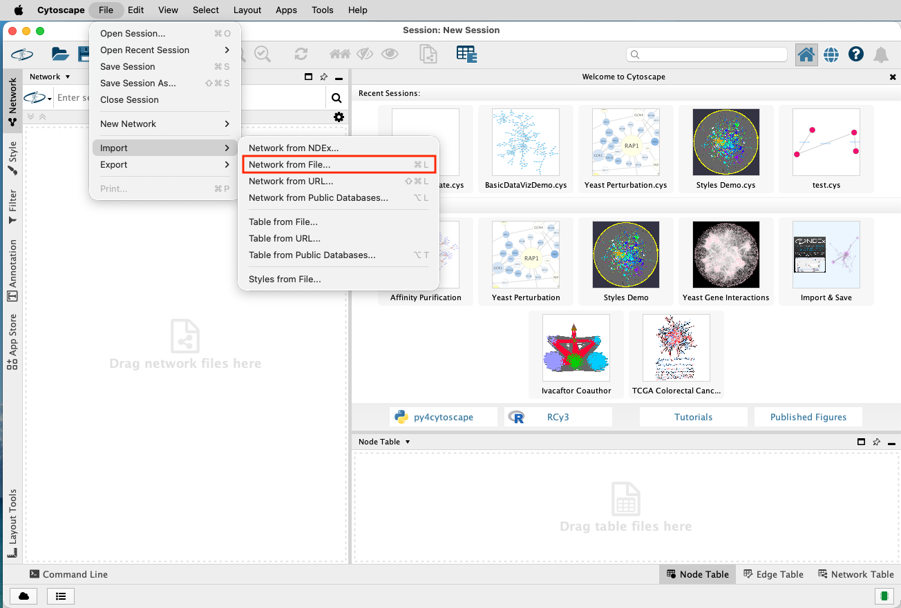
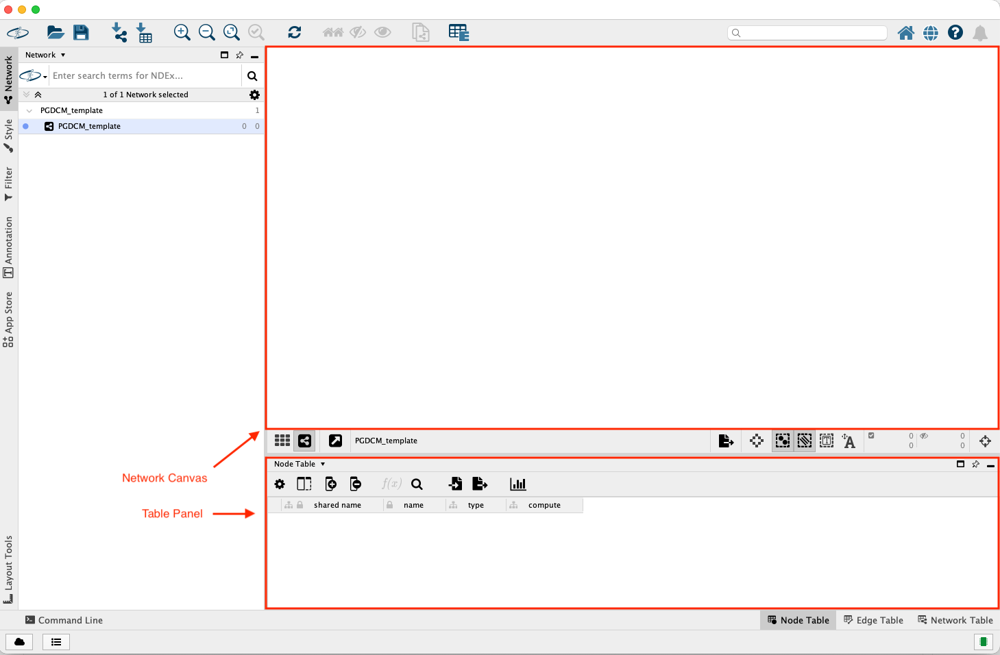
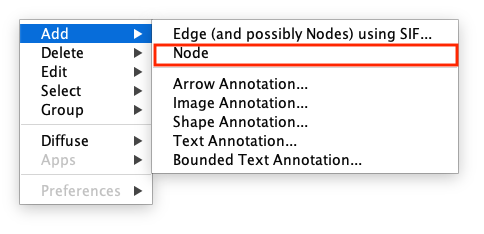
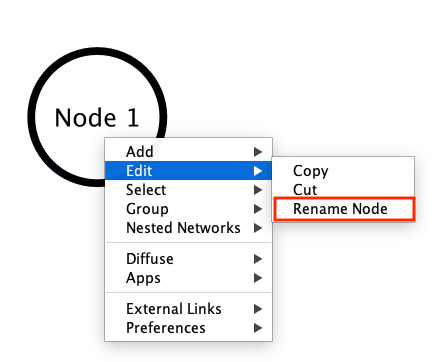
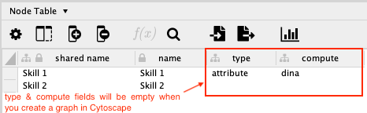
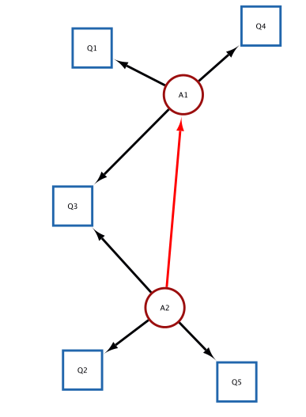

# Introduction

::: callout-tip
## Learning Objectives

By the end of this tutorial, you will be able to:

1.  Understand the two core model components in PGDCM: the **Competency Model** and the **Evidence Model**.
2.  Use Cytoscape to visually build, edit, and inspect your assessment network.
3.  Push data from R into Cytoscape and pull completed models back into R.
4.  Choose the right workflow (Scenario 1–4) based on the data you already have.
:::

## Why Do I Need This?

Imagine you gave a group of students a math test with 10 questions. Some questions require algebra, some require geometry, and some require both. You want to figure out *which skills each student has mastered* - not just their total score.

To do that, you need to tell the model two things:

1.  **What skills exist and how they relate to each other** - this is the **Competency Model** (also called the Proficiency Model).
2.  **Which skills are needed for each test question** - this is the **Evidence Model**.

This tutorial shows you how to build both of these models visually using Cytoscape and the `pgdcm` R package.

## Prerequisites

::: callout-warning
## Before You Start

-   **R knowledge:** You should be comfortable running R scripts and installing packages.
-   **Cytoscape installed:** Download it free from [cytoscape.org](https://cytoscape.org/).
-   **Beginner Tutorial completed (recommended):** If you are new to `pgdcm`, work through the [Beginner Tutorial](Beginner_Tutorial.qmd) first to understand the modeling pipeline end-to-end.
-   No prior knowledge of network science or psychometric modeling is required - we explain the key concepts as we go.
:::

## Key Concepts

PGDCM aligns closely with the **Evidence-Centered Design (ECD)** framework, which uses explicit models to connect what we want to measure with the behaviors we can observe:

-   **Competency Model (Proficiency Model):** Represents the hidden (unobservable) skills we want to measure and how they relate to one another. In Cytoscape, these appear as "Attribute" nodes connected by edges.
-   **Evidence Model:** Defines how observable behaviors (test questions / items) provide evidence for those underlying skills. In Cytoscape, these are the edges pointing from "Attribute" nodes to "Task" (Item) nodes.

## Which Scenario Should I Use?

This tutorial covers four scenarios. Use the table below to jump to the one that matches your situation:

| I already have… | Go to | What it does |
|------------------------|------------------------|------------------------|
| Only raw item response data (no Q-matrix) | [Scenario 1](#scenario-1-starting-from-task-data-building-models-from-scratch) | Pushes item names to Cytoscape; you draw everything else by hand |
| A Q-matrix (items × skills) | [Scenario 2](#scenario-2-importing-an-existing-evidence-model-q-matrix) | Auto-creates the Evidence Model; you draw skill relationships by hand |
| A full adjacency matrix (all nodes & edges) | [Scenario 3](#scenario-3-importing-fully-specified-competency-and-evidence-models) | Auto-creates the full network; you assign node types |
| Previously saved node & edge CSV files | [Scenario 4](#scenario-4-importing-from-saved-node-and-edge-tables-csv) | Rebuilds the model from CSV files |

Before running any script, ensure that **Cytoscape** is open and running on your machine.

## What is Cytoscape?

[Cytoscape](https://cytoscape.org/) is an open-source software platform designed for visualizing complex networks and integrating them with attribute data. In the context of PGDCM, we use the `RCy3` package in R to automatically pass our graphmodels (Tasks and Attributes) directly into and from the Cytoscape application. This allows us to visually construct, verify, and document our Evidence and Proficiency models before finalizing them for analysis.

## Connecting R to Cytoscape

Before passing any data, we need to ensure R can communicate with your active Cytoscape session. We do this by loading the `RCy3` package and "pinging" the default Cytoscape port. Depending on if you are in Mac or Windows, you may need to change the default port. If the cytoscapePing didn't work try getting rid of `/v1` from the cytoPort URL.

```{r setup, message=FALSE, warning=FALSE, eval=FALSE}
# Load required libraries
library(RCy3)
library(igraph)
library(readxl)
library(pgdcm)

# Verify connection to Cytoscape
cytoPort <- "http://localhost:1234/v1"
cytoscapePing(cytoPort)
```

## Getting Started: Loading the PGDCM Cytoscape Template

To ensure your networks are styled correctly right off the bat, you need to load the custom PGDCM Cytoscape Session template. The `pgdcm` package provides a handy utility function to extract this template directly to your R working directory.

1.  In your R console, run `get_Cyto_template()` to download `PGDCM_template.cys` into your working directory.
2.  Navigate to your project folder using your file explorer and double click on the `PGDCM_template.cys` file. This should load Cytoscape with the pre-built Network formatting and styling compatible with `pgdcm` library.

<!-- {#fig-template} -->

## Navigating the Cytoscape Interface

While building PGDCM models, you will primarily interact with three areas in Cytoscape:

1.  **The Network Canvas (Center):** This is where you physically draw edges between Tasks and Attributes. You can click and drag nodes to rearrange the layout to something that makes logical sense for your assessment.

{#fig-panels}

2.  **The Table Panel (Bottom):** This contains the **Node Table** and **Edge Table**.
    -   The nodes table has the following columns:
        -   `name`: Name of the node.
        -   `type`: Type of the node (task or attribute).
        -   `compute`: Computation method for the node (dina or dino).

The name field is automatically updated when you create a node in the Network Canvas area. The type and compute fields are not. So you will have to manually update them in the Node Table. You don't have to make any changes in the Edge Table.

## Adding Nodes and Edges Manually

In several scenarios, you will need to manually augment the network that R pushed to Cytoscape.

**To add a new Node:**

1.  Right-click anywhere in the empty space of the Network Canvas.
2.  Select **Add \> Node**

{#fig-adding-node fig-align="center" width="50%"}

3.  A new node will appear. Immediately go to the **Node Table** at the bottom, find the new row (it usually has a generated name). To change the name of the node, right click on the node and it will show a drop down menu. Select **Edit \> Rename Node** and enter the new name. The name will updated in both the graph as well as the tables.

{#fig-rename-node fig-align="center" width="50%"}

4.  Enter the values for the `type` (attribute/task), and `compute` (`dina`, `dino`, or `continuous`) columns.

::: {.callout-note collapse="true"}
## Advanced: HO-DINA, IRT, and MIRT Specification

You can skip this section on a first read - it is only relevant if you want to model **continuous** latent traits (like a general ability score) rather than binary mastery.

By default, an Attribute with `dina` as its compute method represents a discrete, binary skill (Mastery vs. Non-Mastery). However, PGDCM also supports continuous latent variables. You enable this by changing the `compute` column of a **root node** (a node with no incoming arrows) to `continuous`.

Depending on your network structure, this produces different model types:

| Network structure | Resulting model |
|------------------------------------|------------------------------------|
| One continuous root → discrete children → tasks | **Higher-Order DINA (HO-DINA)**: the root represents general ability ($\theta$), children represent sub-skills |
| One continuous root → tasks directly (no children) | **Unidimensional IRT**: standard Item Response Theory model |
| Multiple continuous roots → tasks directly | **Multidimensional IRT (MIRT)** |

{#fig-edit-fields fig-align="center" width="50%"}
:::

**To add a new Edge:**

1.  Right-click on the **Source** node (the node the arrow should point *away* from).
2.  Select **Add \> Edge**.
3.  A line will attach to your cursor. Click on the **Target** node to complete the edge.

## Editing Large Networks (Hide/Show Sub-networks)

When working with large, complex networks, the Cytoscape canvas can become a tangled "hairball." If you need to focus on a specific sub-network (e.g., a single attribute and its connected tasks), you can temporarily hide the rest of the network without creating a separate Cytoscape network object. This guarantees all structural edits (like adding edges) naturally remain in your primary Evidence/Competency model.

1.  **Select target nodes:** Highlight the nodes you want to focus on. (*Tip:* Select a node, then use \*\*Select \\\> Nodes \\\> First Neighbors of Selected Nodes).
2.  **Hide the rest:** From the Cytoscape Menu, \*\*Select \\\> Nodes \\\> Hide Unselected Nodes.
3.  **Make your edits:** You can now simply adjust the layout, move nodes, add edges, or edit attributes on this isolated sub-network.
4.  **Zoom out back to the full network:** When finished, go to the Cytoscape Menu, \*\*Select \\\> Nodes \\\> Show All Nodes. All your new edits and coordinates will neatly integrate back into the main network!

# Scenario 1: Starting from Task Data (Building Models from Scratch) {#scenario-1-starting-from-task-data-building-models-from-scratch}

In this scenario, you start with just a raw response matrix (often an Excel file). The columns represent tasks (items). There are no attribute nodes or edges yet, meaning neither the Competency nor the Evidence model exists.

Our goal is to push the task nodes into Cytoscape, manually build the rest of the network (attribute nodes and all edges), and then pull the completed graph back to R.

## Step 1: Push Task Nodes to Cytoscape

First, we read the data, extract the item names, and push them to Cytoscape using our helper function `Tasks2CytoNodes()`.

```{r scen1-push, eval=FALSE}
# Read the X matrix
X <- read_excel("testdatafile.xlsx", sheet = 1)
message(sprintf("Loaded X matrix: %d students × %d items", nrow(X), ncol(X) - 1))

# Drop the Subject column; remaining columns are the task (item) names
task_names <- colnames(X)[-1]

# Build nodes from task names and push to Cytoscape
Tasks2CytoNodes(task_names)
```

## Step 2: Build the Network in Cytoscape

At this point, switch to your Cytoscape window.

::: callout-note
## Cytoscape Node Construction

1.  You should see standalone task nodes on your canvas.
2.  Add attribute nodes (e.g., A1, A2). Make sure to set their `type` column to `attribute` in the Node Table.
3.  Draw edges from attributes to task nodes (the Evidence model).
4.  Draw edges between attributes (the Proficiency model).
:::

## Step 3: Pull Network Back and Save

Once the network is complete in Cytoscape, we pull it back into R as an `igraph` object, inspect the data, and save it to a GraphML file.

```{r scen1-pull, eval=FALSE}
# Fetch the active network from Cytoscape
myNetwork1 <- pull_from_cytoscape(base.url = cytoPort)

# Extract clean node and edge tables using our utilities
nodes_table1 <- get_NodesTable(myNetwork1)
edges_table1 <- get_EdgesTable(myNetwork1)

# Check out what we got!
head(nodes_table1)
head(edges_table1)

# Save the network for later
write_graph(myNetwork1, "Scenario1_network.graphml", format = "graphml")
```

::: {.callout-tip collapse="true"}
## What should the output look like?

`head(nodes_table1)` will print a table like:

| name | type      | compute |
|------|-----------|---------|
| Q1   | task      | dina    |
| Q2   | task      | dina    |
| A1   | attribute | dina    |

`head(edges_table1)` will print a table like:

| source | target |
|--------|--------|
| A1     | Q1     |
| A1     | Q2     |
:::

# Scenario 2: Importing an Existing Evidence Model (Q-Matrix) {#scenario-2-importing-an-existing-evidence-model-q-matrix}

In this scenario, you have a **Q-Matrix**. The first column lists task names, and the remaining columns list attribute names. A value of `1` indicates that a specific attribute is required to complete a specific task. This explicitly defines the **Evidence Model** (edges from Attributes to Tasks).

We will push this Q-Matrix to Cytoscape, which will automatically draw the task nodes, attribute nodes, and evidence edges for us.

We'll use a mock Q-Matrix for this example. We use the helper `QMatrix2CytoNodes()` which automatically builds the graph and pushes it. Note that `QMatrix2CytoNodes()` calls `QMatrix2iGraph()` internally, which you can use if you only want the `igraph` object without pushing it.

```{r scen2-push, eval=FALSE}
# Define a mock Q-Matrix
Q_mock <- data.frame(
    Task = c("Q1", "Q2", "Q3", "Q4", "Q5"),
    A1 = c(1, 0, 1, 1, 0),
    A2 = c(0, 1, 1, 0, 1),
    stringsAsFactors = FALSE
)

# Build igraph and push to Cytoscape simultaneously
g_qmatrix <- QMatrix2CytoNodes(Q_mock, title = "Scenario2_QMatrix")
```

{#fig-q2graph fig-align="center" width="50%"}

# Scenario 2 (Continued): Graphically Defining the Competency Model

Once the Evidence Model is pushed to Cytoscape, you can graphically define the **Competency Model** structure by drawing dependencies (edges) directly between the attribute nodes.

Switch to your Cytoscape window.

::: callout-note
## Adding Proficiency Edges

1.  The Task nodes, Attribute nodes, and the evidence edges (Attribute → Task) are already drawn.
2.  Verify the layout.
3.  Draw the proficiency model (edges *between* attributes).
:::

{#fig-prof-model fig-align="center" width="50%"}

## Pulling the Network Back and Save

```{r scen2-pull, eval=FALSE}
myNetwork2 <- pull_from_cytoscape(base.url = cytoPort)

# Fetching the nodes and edges from the network in Cytoscape
nodes_table2 <- get_NodesTable(myNetwork2)
edges_table2 <- get_EdgesTable(myNetwork2)

# Displaying the nodes and edges in R
knitr::kable(nodes_table2, caption = "Nodes Table")
knitr::kable(edges_table2, caption = "Edges Table")

# We comment out write_graph here during rendering so it doesn't constantly overwrite your file
# write_graph(myNetwork2, "Scenario2_network.graphml", format = "graphml")
```

# Scenario 3: Importing Fully Specified Competency and Evidence Models {#scenario-3-importing-fully-specified-competency-and-evidence-models}

In this scenario, you have a full **Adjacency Matrix** detailing all edges between all nodes. This matrix fully defines both the Competency Model (attribute-to-attribute edges) and the Evidence Model (attribute-to-task edges). The first column contains all node names (both tasks and attributes). The remaining columns are identically named. A `1` indicates a directed edge from the Row node to the Column node.

In this scenario, the utility function `AdjMatrix2CytoNodes()` extracts the nodes and edges, but leaves the node `type` blank for you to define manually.

## Step 1: Push Adjacency Matrix to Cytoscape

```{r scen3-push, eval=FALSE}
# Define a mock Adjacency Matrix
Adj_mock <- data.frame(
    Node = c("A1", "A2", "Q1", "Q2"),
    A1 = c(0, 1, 1, 0),
    A2 = c(0, 0, 0, 1),
    Q1 = c(0, 0, 0, 0),
    Q2 = c(0, 0, 0, 0),
    stringsAsFactors = FALSE
)

# Build igraph and push to Cytoscape simultaneously
g_adj <- AdjMatrix2CytoNodes(Adj_mock, title = "Scenario3_AdjMatrix")
```

## Step 2: Assign Types and Edit in Cytoscape

Switch to your Cytoscape window.

::: callout-note
## Assigning Node Types

1.  The network structure (both nodes and all edges) is drawn automatically.
2.  Open the Node Table in Cytoscape. The `type` column will be blank (or `NA`).
3.  Manually assign `"attribute"` or `"task"` to each node.
4.  Modify the layout or tweak edges if required.
:::

## Extracting Data and Saving Your Model

Once your model visualization is complete, you must pull it back into R.

We can then use two functions to directly inspect the tabular details of what we've drawn:

1.  `get_NodesTable(myNetwork3)`: This extracts a standardized `data.frame` of every single node in your graph, including its `name`, structural `type` (attribute or task), and `compute` methodology (DINA, DINO, etc.).
2.  `get_EdgesTable(myNetwork3)`: This extracts a standardized `data.frame` mapping the `source` node to the `target` node for every edge in your network.

While it might be tempting to save these two `data.frames` directly as `.csv` files, **we strongly recommend saving as `.graphml` instead**. Why?

-   The `.graphml` format preserves all node attributes, edge structure, and layout information in a single file.
-   `.graphml` is an open standard compatible with most network analysis tools in R and Python.

```{r scen3-pull, eval=FALSE}
# Pull the completed graph down from Cytoscape
myNetwork3 <- pull_from_cytoscape(base.url = cytoPort)

# (Optional) Extract the raw tables for visual inspection
nodes_table3 <- get_NodesTable(myNetwork3)
edges_table3 <- get_EdgesTable(myNetwork3)

knitr::kable(nodes_table3, caption = "Nodes Data")
knitr::kable(edges_table3, caption = "Edges Data")

# Save the final structured graph as a GraphML file
write_graph(myNetwork3, "Final_Competency_Model.graphml", format = "graphml")
```

# Scenario 4: Importing from Saved Node and Edge Tables (CSV) {#scenario-4-importing-from-saved-node-and-edge-tables-csv}

In this scenario, you might have previously saved your `nodes_table` and `edges_table` to `.csv` files (perhaps bypassing GraphML initially or intending to make bulk edits in Excel before re-importing).

## Step 1: Rebuild the Model Object in R

The `build_from_node_edge_files()` utility automatically standardizes the column names of your CSVs and converts them into a Nimble-ready igraph object.

```{r scen4-build, eval=FALSE}
# Read your previously saved nodes and edges
# (Assuming they were saved using write.csv(nodes_table, "my_nodes.csv", row.names=FALSE))

# Rebuild the igraph object directly
myNetwork4 <- build_from_node_edge_files(
    NodesFile = "my_nodes.csv",
    EdgesFile = "my_edges.csv"
)

```

## Step 2: (Optional) Push the Network Back to Cytoscape

If you realized you still need to make *visual* edits to your model, you can instantly push these raw tables back directly into the Cytoscape canvas using the `push_to_cytoscape()` wrapper.

```{r scen4-push, eval=FALSE}
# Load the CSVs as raw data.frames
loaded_nodes <- read.csv("my_nodes.csv", stringsAsFactors = FALSE)
loaded_edges <- read.csv("my_edges.csv", stringsAsFactors = FALSE)

# Push the components right back into the visual canvas!
push_to_cytoscape(
    nodes = loaded_nodes,
    edges = loaded_edges,
)
```

# What's Next?

Now that you have a fully specified model saved as a `.graphml` file, you are ready to run the analysis:

-   **New to PGDCM?** Start with the [Beginner Tutorial](Beginner_Tutorial.qmd) to learn how to configure and run a Bayesian MCMC model using your network.
-   **Ready for more?** The [Advanced Tutorial](Advanced_Tutorial.qmd) covers convergence diagnostics, posterior predictive checks, and model comparison.